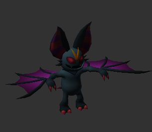
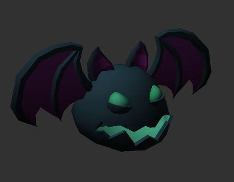
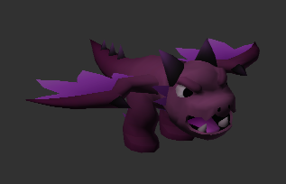
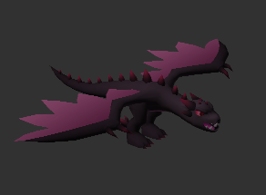

# Monesters
| **图鉴**   | **怪物名称**   | **种类**   | **HP（生命值）** | **ATK（攻击力）** | **DEF（防御力）** | **MDEF（魔法抗性）** | **SPD（速度）** | **特殊能力**                         |
|----------------|----------------|------------|------------------|------------------|------------------|---------------------|-----------------|--------------------------------------|
|| 火焰兽        | 火焰系     | 120              | 30               | 15               | 10                  | 20              | 火焰喷射：造成火焰伤害，范围攻击   |
|| 冰霜巨人      | 冰霜系     | 180              | 25               | 40               | 15                  | 10              | 冰冻冲击：降低敌人速度和攻击力     |
|| 毒龙          | 龙类       | 300              | 40               | 30               | 20                  | 15              | 毒气吐息：造成持续毒性伤害         |
|| 影刺客        | 暗影系     | 80               | 45               | 10               | 30                  | 35              | 暗影步：提高闪避率，反击敌人       |
|| 巨型蜘蛛      | 怪物       | 150              | 35               | 25               | 10                  | 15              | 毒丝网：使敌人行动迟缓             |
|| 石像怪        | 石化系     | 250              | 50               | 50               | 25                  | 5               | 石化凝视：降低敌人防御并造成伤害   |
|| 霜冻狼        | 野兽       | 100              | 35               | 20               | 15                  | 25              | 冰霜之牙：造成冰霜伤害并冻结敌人   |
|| 地震魔兽      | 地震系     | 220              | 60               | 40               | 20                  | 10              | 地震：造成全体伤害并震晕敌人       |
|| 雷电巨人      | 雷电系     | 280              | 55               | 35               | 30                  | 12              | 雷霆一击：造成高额电击伤害         |
|| 黑暗领主      | 黑暗系     | 350              | 70               | 45               | 50                  | 8               | 黑暗诅咒：使敌人中毒并减少HP恢复   |
|| 骷髅战士      | 不死系     | 100              | 20               | 30               | 5                   | 10              | 骨刺：物理伤害并有概率造成中毒     |
|| 雷暴鸟        | 风系       | 140              | 25               | 15               | 20                  | 40              | 龙卷风：造成风系伤害并击退敌人     |
|| 深渊魔神      | 恶魔系     | 500              | 80               | 60               | 40                  | 5               | 地狱火焰：大范围火焰攻击敌人       |
|| 白虎          | 野兽       | 220              | 60               | 30               | 20                  | 25              | 狂野攻击：大幅提高攻击并对敌人造成连击|
|| 毁灭之龙      | 龙类       | 600              | 100              | 80               | 40                  | 10              | 毁灭火焰：全体火焰伤害             |

| **dong**   | **怪物名称**   | **种类**   | **HP（生命值）** | **ATK（攻击力）** | **DEF（防御力）** | **MDEF（魔法抗性）** | **SPD（速度）** | **特殊能力**                         |
|----------------|----------------|------------|------------------|------------------|------------------|---------------------|-----------------|--------------------------------------|
|| 火焰兽        | 火焰系     | 120              | 30               | 15               | 10                  | 20              | 火焰喷射：造成火焰伤害，范围攻击   |

待机，攻击，被击