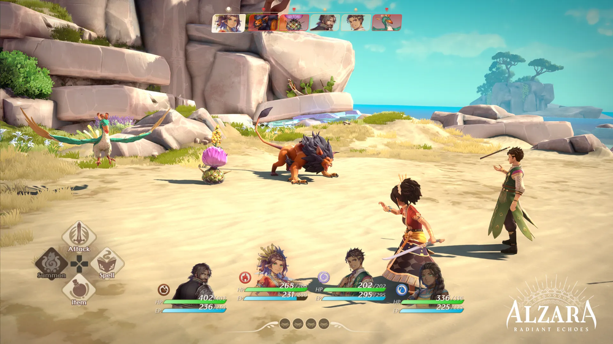
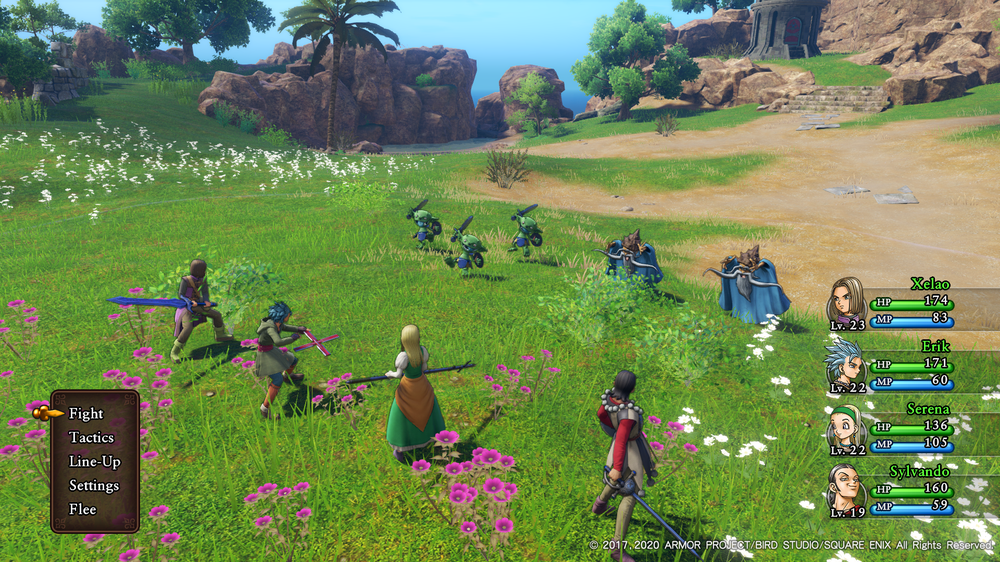

# 战斗模块

## 通用数据
### 环境数据   
**时间系统**：白天夜晚（有的怪或NPC或剧情触发，在夜晚才出现，反之大部分NPC在白天才活动）   
**环境区域**：需要从地图数据获取，看是何种方式区分出地图地形区域

## 战斗启动条件
战斗是游戏的核心玩法之一，以下是详细的战斗逻辑。   
触发战斗方式根据开发难度和成本选择一种。

### 1. 暗雷触发方式(步数+区域触发机制)
地图上没有视觉表现的野怪。通过步行数的阈值，增加触雷的概率。
#### 基础触发机制
- 初始触发概率：0%
- 步行计数器：每走一步，计数 +1
- 走 20 步以内：不会触发战斗（0% 概率）。
- 走 20 步后：每走 1 步，增加 5% 触发概率。
- 当触发后，计数器重置。

#### 不触发战斗的情况
- **安全区**：如城镇、主城等。
- **任务区域**：如特殊剧情点，不希望随机战斗干扰。
- **地图特殊设定**：如某些神秘区域，野怪不会出现。
- **潜行模式**：若玩家有潜行能力，降低或关闭触发概率。

#### 地形影响
| 地形类型   | 步数阈值 | 触发概率增长    |
|------------|----------|-----------------|
| 普通地形   | 20 步    | +5% / 步        |
| 复杂地形   | 15 步    | +8% / 步        |
| 危险区域   | 15 步    | +10% / 步       |

#### 天气影响
- **大雾/夜晚**：触发概率加速（+2% 额外增长）。
- **晴天**：触发概率降低（如 +3%/步 而不是 5%）。

#### 角色技能影响
| 技能       | 影响效果                  |
|------------|---------------------------|
| “探知”技能 | 每次步行概率减半（5% → 2.5%）。  |
| “侦察”技能 | 遇敌概率降低 30%。          |
| “风行”技能 | 触发概率延迟（20 步变 25 步）。 |

#### 装备影响
| 装备          | 影响效果                      |
|---------------|-------------------------------|
| “隐秘斗篷”    | 减少 50% 遇敌概率。             |
| “诅咒护符”    | 固定每 10 步必定触发战斗。      |

---
### 2. 明雷触发方式
参考游戏：[勇气默示录2](https://www.bilibili.com/video/BV1bA411N7iH?spm_id_from=333.788.videopod.episodes&vd_source=9cdd98cc53d87aeb4190d2743832662b&p=9)   

明雷触发方式要求敌人具有巡逻、范围检测和目标跟随功能。通过在大地图上生成野怪点，并实现一些特定机制来触发战斗。

#### 野怪巡逻
- **巡逻模式**：每个野怪的巡逻区域（可以两点或三点间来回走动），野怪在该区域内会随机在移动和待机间循环。

#### 范围检测
- **感知机制**：每个巡逻怪物拥有一个固定的感知范围。在角色制作阶段用碰撞体来实现（敌人可能拥有不同的感知范围）。玩家一旦进入该范围，野怪会立刻变得警觉（有警觉提示特效），向玩家靠拢。

#### 目标跟随
- **目标锁定**：当野怪进入警觉状态后，它会开始锁定玩家的位置。锁定后，敌人会尽可能向玩家移动，试图接近玩家触发战斗。
- **追踪行为**：敌人将不受巡逻路径的限制，专注于追踪玩家，直到进入战斗区域或玩家逃脱。可以触发多个敌人追踪，但只能触发最先的战斗。

#### 战斗触发和重置
- **逃跑判断**：玩家逃跑成功的标准可以是进入特定的安全区域（城市）或远离敌人足够的距离。
- **逃跑失败**：如果玩家未能逃脱，敌人将继续追踪并进入战斗场景。在玩家与敌人接触后，战斗将自动触发。
- **重置**：完成战斗后回到场景前，巡逻怪的初始位置重置。

#### 角色技能与装备影响
| 技能        | 影响效果                        |
|-------------|---------------------------------|
| “潜行”技能 | 减小巡逻怪的碰撞监测球大小。减少玩家被发现的几率  |
| “疾步”技能 | 快速移动，增加逃脱时的成功率。                           |

| 装备          | 影响效果                        |
|---------------|---------------------------------|
| “轻装”        | 增加移动速度，提高逃跑几率。                |
| “伪装服”      | 降低敌人对玩家的感知范围，减少被发现的几率。      |
| “响亮铃铛”    | 增加敌人发现玩家的概率，可以在特殊策略中使用。  |

## 战斗流程
### 1.场景初始化
#### 场地/环境数据
包括战斗地图、时间配置、背景音乐、环境音效。
- **黑屏过渡**：当触发战斗时，游戏画面会瞬间变黑，随后屏幕逐渐淡入，展示新的战斗场景。 
- **战斗场景匹配**：战斗场景需要与玩家当前所处的环境相匹配。例如，如果战斗触发发生在森林中，战斗场景将呈现为森林背景；若发生在洞窟中，场景则应模拟石洞等环境。

#### 场景资源文件
| 场景名称                         | 环境类型     | 天气/时间条件 | 说明                                                     | 背景音乐                      |
|----------------------------------|--------------|----------------|----------------------------------------------------------|-------------------------------|
| `battle_sence_grass_sunny`       | 草原         | 晴天           | 草原上的明媚阳光，温暖的氛围，适合广阔的战斗和对决。                   | `Heroic Plains`              |
| `battle_sence_grass_night`       | 草原         | 夜晚           | 夜晚的草原，寒气逼人，战斗中的气氛更加紧张。                                | `Moonlit Battle`             |
| `battle_sence_forest_foggy`      | 森林         | 雾霾天气       | 被雾气笼罩的森林，能见度低，适合埋伏和偷袭，敌人可能隐藏在迷雾中。               | `Whispers in the Mist`       |
| `battle_sence_forest_night`      | 森林         | 夜晚           | 黑暗中的森林，只有月光照亮道路，适合隐匿和突然袭击。                         | `Shadow of the Trees`        |
| `battle_sence_cave_dark`         | 洞窟         | 黑暗           | 洞窟内充满阴冷与湿气，战斗中可能有回声影响，并且敌人行动更加隐秘。                  | `Echoes of the Abyss`        |
| `battle_sence_snowy_mountain`    | 雪山         | 大雪           | 高山上的大雪覆盖，极寒的天气与险峻的地形增加了战斗的困难度。                        | `Frozen Resolve`             |
| `battle_sence_ancient_temple`    | 古寺         | 清晨/日落       | 在古老的寺庙废墟中，清晨或日落时分的光线从破碎的屋顶洒下，阴影和光明交织，气氛神秘且紧张。 | `Relics of the Past`         |
| `battle_sence_riverside`         | 江边         | 晴天/夜晚       | 江边或湖泊附近的战斗，水面反射着月光或日光，环境宽阔，适合剑客的对决。            | `Rippling Blades`            |
| `battle_sence_village_night`     | 村庄         | 夜晚           | 夜晚的江湖村庄，四周寂静，适合进行秘密任务或突如其来的敌人袭击。                  | `Silent Danger`              |
| `battle_sence_mountain_cliff`    | 山崖         | 多云           | 战斗发生在险峻的山崖上，悬崖边的战斗极具风险，需要技巧与精准的攻击。               | `Edge of Fate`               |
| `battle_sence_ghost_cavern`      | 幽冥洞窟     | 黑暗/阴风       | 幽冥洞窟，周围是阴森的黑暗与阴风，适合面对来自冥界或亡灵敌人的战斗。                  | `Wailing Spirits`            |
| `battle_sence_desert_sands`      | 沙漠         | 沙尘暴         | 沙漠中的战斗，沙尘暴遮蔽视野，极端的环境挑战着武者的体力与耐力。                    | `Storm of the Dunes`         |
| `battle_sence_pine_forest`       | 松林         | 晴天           | 松林中清新的空气和古老的树木，是一片幽静而神秘的战斗场地，适合剑法与轻功的较量。      | `Dance of the Blades`        |

#### 视角
在战斗阶段，摄像机会设定为玩家视角的斜上方背后。这样能够清晰显示玩家的动作、敌人的位置以及战斗区域的整体情况。   
   

#### 玩家队形站位及状态
- 角色双方在战斗待机状态。等待玩家的操作 
- 最多四人组队  
- 站位方式：所有队员按照 从左到右的水平排布，固定顺序，通常按照队伍编成中的角色排列
- 最左侧：通常为队长或主角，代表队伍的核心角色。中间角色：通常是辅助型或平衡型角色，例如治疗、增益类角色。最右侧：通常是远程攻击或魔法角色，以确保他们在视觉上靠后，符合“后排输出”概念。    
#### 敌人队形站位 
敌人的初始位置   


### 2.战斗执行阶段

#### 玩家操作与信息显示
- **行动选择**：当玩家选择某个角色时，玩家信息条保持选中状态，同时弹出行动面板，选择后进入二级菜单选择对应项，提供玩家选择攻击、技能、物品、防御，逃跑等选项。
- **选择施展对象**：在前一步选择了操作项后，玩家可以选择目标敌人或行动对象。当目标被选中时且有效时，场景内的角色会高亮显示（材质属性变化）。如果无效，会弹出简单UI提示操作无效。(如不能对敌方进行加血)
- **计算伤害**：如果命中，将计算出的伤害从防御者的生命值中扣除。计算并扣除使用技能所需的MP。如果带有特殊效果，则根据效果类型和规则进行计算和应用（如中毒、眩晕、治疗等）。
- **回合提示**：回合完成后，摄像机会拉近，提示玩家操作 
- **敌人信息**：只在选择时显示敌人名称。不显示血量。

#### 战斗播放
**摄像机调整**：玩家选择完成后，进入动画播放流程。摄像机会稍微拉远，确保玩家能看到战斗的全貌    
**摄像机反馈**：玩家受暴击时有震屏  
**战斗播放加速**：暂定10级后，左上角会出现战斗加速按钮

#### 敌人AI
敌人则根据预设的AI逻辑选择动作。（待细化和讨论）

### 3.战斗结算   
如果敌人被击败，则根据敌人的基础经验值和玩家的等级计算获得的经验值。并根据Characters_LevelGrowth表提升属性。  
奖励系统：例如战利品、经验、金钱等。
剧情过渡：如胜利时的胜利动画或失败后的游戏提示。
后续发展：根据战斗结果，剧情走向的改变。

### 4.战斗结束
结算完成后,清理战场，返回游戏场景。
如果玩家被击败，弹出UI窗口。


## 战斗公式

### 战斗属性
- **攻击力（ATK）**：角色或怪物的物理攻击力，用于计算物理伤害。  
- **防御力（DEF）**：角色或怪物的物理防御力，用来减少受到的物理伤害。   
- **魔法攻击力（MATK）**：角色或怪物的魔法攻击力，用于计算魔法伤害。   
- **魔法防御力（MDEF）**：角色或怪物的魔法抗性，用来减少受到的魔法伤害。   
- **速度（SPD）**：影响出手快慢，回合顺序，但对伤害计算的直接影响较小。 
- **敏捷（Agility ）**：命中率，暴击，闪避相关。  
- **暴击概率（Critical Rate）**：触发暴击的几率，用于决定是否造成额外伤害。  
- **闪避概率（Dodge Rate）**：触发闪避的几率，决定是否完全规避攻击。  
  
### 初始化角色和敌人属性
加载角色和敌人的属性值。  

### 战斗计算  
#### 计算逻辑分层
整个计算过程分为五个层级：
1. **基础伤害计算**：基于ATK、MATK、DEF、MDEF等核心属性进行初步伤害计算。
2. **Buff/Debuff影响**：考虑增益或减益状态对伤害的具体调整。
3. **暴击修正**：若触发暴击，则按暴击系数放大伤害结果。
4. **随机波动**：引入概率因素，使伤害值在一定范围内变化。
5. **最终汇总**：将所有计算结果综合，得出实际造成的总伤害。

#### 设计理念
这种分层计算方式遵循“加减法为核心，概率修正为补充”的设计思想：
- **核心属性决定基础强度**：ATK、DEF等基本属性是战斗数值体系的基石。
- **技能与状态提供策略性**：Buff/Debuff赋予玩家或角色调整战局的可能性。
- **暴击与闪避增加随机性**：概率机制让战斗结果更具不可预测性，提升游戏趣味性。

---
#### 1.1 计算先手
```
先攻值 = 敏捷值Agility + 随机值(1到20) 颠三倒四大多数的
```
较高先攻值的角色先行动
根据先攻值排序，确定行动顺序。

#### 1.2 闪避计算
每回合攻击时根据**闪避概率**触发闪避。闪避成功时，本次攻击直接无效，不计算伤害。  
```
闪避率 = 基础闪避率(0.05) + (防御者敏捷Agility - 攻击者敏捷Agility) * 0.005
```
每一回合只能选择一种攻击方式，分为物理攻击（武技）和魔法攻击（道法）两种。  
某些特定技能（如大招）会结合物理和魔法攻击的伤害，需叠加计算。
**总伤害 = 物理伤害 + 魔法伤害**

#### 2.1 物理伤害计算公式
```
物理伤害 = [(攻击力 × 技能系数) - 防御力] × 随机波动（0.9 ~ 1.1）  
物理伤害 = (攻击者物理攻击力 + 武器伤害) * (1 + 随机值) - (防御者物理防御力)* (1 + 随机值)
```
#### 2.2 魔法伤害计算公式
```
魔法伤害 = [(魔法攻击力 × 技能系数) - 魔法抗性] × 随机波动（0.9 ~ 1.1）   
魔法伤害 = (攻击者魔法攻击力 + 技能伤害) * (1 + 随机值) - (防御者魔法防御力)* (1 + 随机值)
```

#### 3.1 AOE
```
全体伤害 = 技能伤害 ÷ 目标数
```
**说明**：全体伤害的值会被分摊到每个目标。例如：  
“天雷灭世诀”对全体敌人造成175点总伤害，目标数为4：
```
全体伤害 = 175 ÷ 4 = 43.75
```

#### 3.2 暴击
   

暴击率 = 基础暴击率(如0.05) + 攻击者Luck * 0.002

- 玩家或怪物攻击前投掷两个20面骰，分别记为 D1 和 D2。
- 如果两颗骰子的点数之和大于等于暴击触发阈值，则触发暴击。  
```
是否暴击 = (D1 + D2 + 装备修正值) ≥ 暴击阈值
```
- 暴击成立时，伤害计算公式为：  
```
实际伤害 = 普通伤害 × 暴击系数
```
#### **逃跑**

- 逃跑成功的概率由玩家和怪物的**等级差**决定。  
```
逃跑成功率 = 基础逃跑率 + (玩家等级 - 怪物等级) × 等级系数
```
- 如果逃跑失败，由于消耗了行动回合，进入敌方攻击回合。

## UI布局  
### 战斗界面的初始化
包括生命条、魔法条、行动菜单等。  
  
- **出手顺序滑动条**：战斗中敌我双方的出手进度显示。
- **行动菜单**：玩家选择的行动选项。
- **生命条和能量条**：每个角色都有独立的生命条、能量条和状态显示，提供清晰的战斗信息。