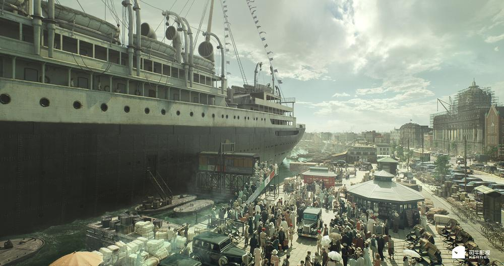
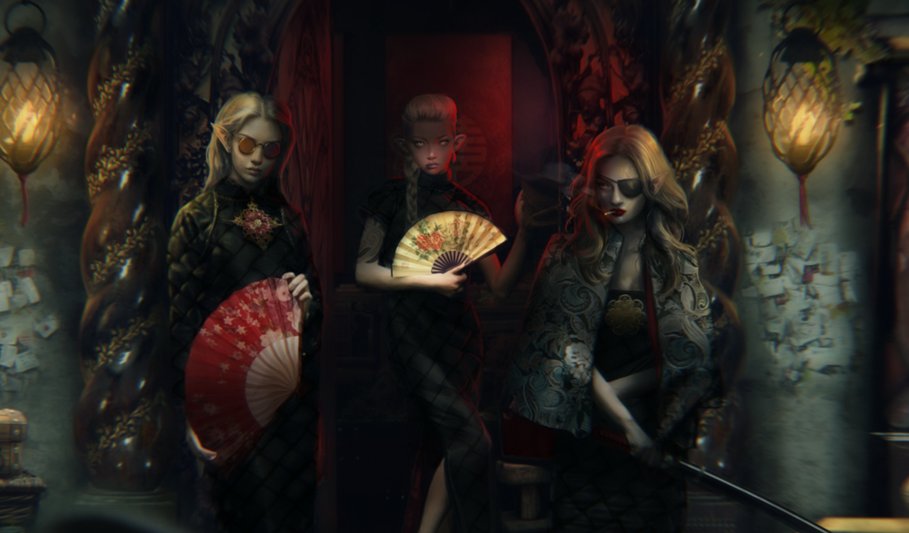
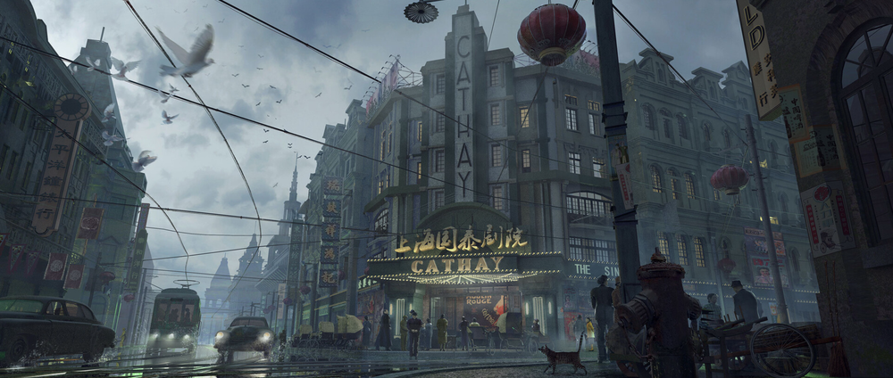

# 神遗：蒸汽妖都
将女娲神话传说、西方吸血鬼传说、基因改造、蒸汽工业革命结合，重新诠释东西方传说。   
## 核心设定  
- ​​娲术​​：女娲补天遗留的基因编撰技术，可融合万物基因创造新物种,被周王室封印于昆仑墟
- 血族  娲术与人结合的产物，需要血来维持生命活力  
- 蜃楼舟​​：搭载反重力娲术的巨型空舰，核心动力来自女娲石碎片 

## 主角团的成员
陈少秋：20岁，陈氏实业之子，归国留学生。  
林晚晴​: 18岁，江南精武堂之女​，又学习中西方医术和传统国术（补血，法师）   
阿伊莎：奥斯曼帝国女学者，精通中东古文字和炼金术。（刺客）   
朱利安：法国工程师，擅长机械和密码学，可能和达芬奇手稿有关。巴黎综合理工学院天才，痴迷达芬奇手稿中的反重力设计   
陆明夷​：容闳推荐的首批官派留学生，掌握电报密码与蒸汽轮机技术   
伊万诺维奇​：沙俄探险家   

## 技能系统设计
- ​陈少秋 (平衡型/输出)：​​ “灵枢冲击者”电击/霰弹模式切换；“娲石共鸣” (临时强化武器/队友)；“战术分析” (提升暴击/降低敌防)。
- ​​​​林晚晴 (辅助/控制)：​​ “银针渡穴” (单体治疗/解状态)；“八段锦·锁” (单体禁锢/降攻防)；“百草清瘴” (群体驱散/弱回复)。
- ​​朱利安 (工程/干扰)：​​ “齿轮陷阱” (地格效果：减速/持续伤害)；“特斯拉电涌” (范围麻痹)；“应急修理” (修复护甲/道具)。
- 血族：​​ “血仆” (速度快，低防，带吸血)；“魅影” (闪避高，精神攻击)；“铁手类型” (高防厚血，范围攻击)；「猩红咏叹」（声波吸血）。
- 娲术「灵枢重构」（修改敌人DNA链造成变异反噬）  

## 收集系统​​
-  ​关键物品：​​ 主线必须的剧情道具（青铜罗盘、娲石碎片、方尊、玉玦等）。   
-  ​材料/配方：​​ 武器/装备/道具合成升级所需（幽灵磁石、月光琉璃碎片、百年血竭、精钢齿轮、妖兽骨粉等）。可通过商店购买、支线任务、特定敌人掉落、地图探索获得。
- ​上海纪闻：​​ 报纸碎片，记录历史事件、社会动态、血案传闻（世界背景）。
- ​娲术残篇：​​ 散落的竹简/羊皮纸，解释娲术原理、血族起源、妖兽弱点（游戏知识库）。
- ​角色手记：​​ 林晚晴的医案、朱利安的草图笔记、陈少秋的调查报告（角色塑造）。

## 序章
女娲离开后留下了以双蛇螺旋为基础的生命改造术，又被称为娲术。  
相传,娲术可以让生命永生，在这探索的过程中，诞生了上古各种妖兽，其中部分被先民记录在《山海经》中。    
但妖兽的血脉不稳定，大多变异毁灭，化作一滩血水。其中有一派将娲术与人结合，它们开始以血为食，维持生命态的稳定，成为血族的起源。
娲术从此被视为妖术，被封印在了隐秘之处......    
   
## 上海篇·蒸汽妖都
### 留学归来  
#### 码头解围   
   
海港码头，轮船靠岸，陈少秋从船上下来。   
遇到港口斧头帮强取豪夺，调戏少女林晚晴。陈少秋见义勇为，加入战斗。（介绍基本的战斗教学）   
获胜后得到少女林晚晴感谢，邀约陈少秋来日拜访。  
#### 家里 陈公馆
（地图解锁：外滩街道->陈公馆）参考女神异闻录   
    
可对话路人    
陈少秋回到家里 ，和父亲对话（在英国留学期间查阅各个博物馆图书档案馆，发现了关于娲术与血族的关联）。   
祭拜祖堂。陈少秋的母亲在留学期间去世，是陈少秋的一大悲伤。（未来伏笔，陈少秋复活母亲的选择）  
家族一直在收集殷商遗物，希望从中获取线索，希望借助娲术可以增加实业和国家实力。   
在陈少秋家的实验室，陈少秋将家里的传下的娲石碎片做成武器（需要设计几个跑腿任务，收集一些必要的道具，熟悉城市地点）   

一个物品是斧头帮黑市找磁石  
一个是圣三一堂找月光琉璃  
最后一个物品，去往医馆，开门的是林晚晴。可触发林晚晴技能教学（学习初级“银针渡穴”），交流最近的 民间 传言。提升林晚晴好感度。林晚晴加入小队

获取所有物品后，利用娲石为能量来源，结合枪械和电气，制造出武器。（战斗教学）
父亲交代近日有一个拍卖会，拍卖青铜器，托付陈少秋前往。 

#### 支线任务 (可选)：码头风波​​
目标：帮助码头工头清理受娲术能量影响变异的鼠群。
内容：在码头货堆区域战斗。展示变异敌人。
奖励：金钱，“蚀骨血蝎” (材料，可能用于毒抗药)。
#### ​支线任务 (可选)：消失的学徒​​
目标：应药店老板所托，寻找在失踪的学徒。
内容：追踪线索，在特定时间/地点进入战斗（血仆绑架）。
奖励：特殊药剂配方，“沾染血污的日志” (补充血族背景)。

### 血月拍卖会  
#### 血族密谋
   
豪华套间内（窗外是外滩夜景与一轮将圆的红月）
屋里一群西装革履的人，有西方面孔和东方面孔 。​   
​优雅领袖「宋先生」​​（华裔血族，着丝绸长衫，举止如旧式文人）轻晃红酒杯：“方尊内蕴藏的碎片，是始祖赐予我等的圣物钥匙。” 
     
​暴躁手下「铁手」​​（西方面孔，义肢闪着寒光）：“直接杀光抢走岂不更快？何必拍卖？”   
​​妖艳魅惑「苏菲亚」​​（混血，穿紧身蕾丝裙）舔舐嘴唇：“亲爱的，享受猎物的恐惧与希望破灭…才是无上美味。” 奸笑回荡。  
一个侍女小姐推门进来，懵懂侍女端酒进来。房门在身后无声关闭。侍女小姐吓得惊慌失措....
#### 不祥之兆  
陈少秋一路走向拍卖场，街上的卖报员吆喝卖报，昨夜又现离奇连环死亡案件，少女的血液被吸干，路人也人心惶惶。也有人讨论拍卖会的传闻。​路人议论：​​ “听说了吗？今晚拍卖行有国宝现世。  
拍卖会门口遇到林晚晴，寒暄。
#### 盛宴劫掠  
       
进入拍卖行，外滩「赫德拍卖行」夜宴，多次竞标后，陈少秋拍得青铜器。      
       
准备交接时，血族出现。陈少秋战斗，​宋先生​​ 鬼魅般出现在他身后，一记重击（可能附加诡异毒素/吸能），受伤失败。青铜器被抢走。  
危机中，朱利安​​从混乱的上层包厢现身！他抛出数个特制 ​​烟雾/强光弹​，利用一条精巧的​滑索钩爪装置，抱起陈少秋和林晚晴，冲破窗户飞驰逃离 
#### 家里 迷雾重重​
​​陈少秋苏醒。
朱利安解释：​​ 我追踪这伙"人"很久了。各种证据显示是西方的血族来到这里。他们在寻找什么呢？
苏醒的陈少秋需要追踪血族，并找寻娲术的线索。收集报纸看各地新闻 
朱利安加入队伍。解锁“工程技能系统”。

### ​收集任务（可选）：血案档案​​
目标：在上海不同区域（租界巡捕房外告示板、茶馆闲谈）收集关于吸血案件的报纸碎片（3/5/10片）。
内容：地图探索，对话特定NPC。
奖励：完成度越高，对血族特性了解越深（战斗界面显示弱点/抗性）。      
       
### 支线任务（可选）：精武堂的求助​​
目标：应林镇南（通过林晚晴）要求，调查一处疑似血族巢穴的废弃仓库。
内容：小型地牢探索，战斗（保护漕帮成员），Boss：强化版血仆。
奖励：林晚晴专属饰品图纸，“漕帮的友谊” (解锁华界部分区域快速通行)。       
       
### 工程任务（可选）：巧匠的订单​​
目标：朱利安需要特定零件改造装备或制作新道具。
内容：收集稀有材料（如“特斯拉线圈碎片”、“秘银丝”）或完成特定小游戏（如接线/拼图）。
奖励：新装备、强力消耗品（如“强光震撼弹”对血族特攻）。

### 黑市  
斧头帮控制的地盘，询问血族的线索

### 徐光启墓  
查到血族在上海的重要据点可能在 ​​徐家汇​​附近的 ​​旧耶稣会旧址/徐光启墓地​​ 一带（漕帮发现该区域有不寻常的马车频繁出入）  
   
寻找隐秘入口，触发机关解密。地下迷宫。​ 进入后发现这里被改造成血族临时据点    
    
#### ​主线任务（BOSS战）：再战铁手！​​
目标：击败守护核心区域的“铁手”。
#### 胜利与线索
击败“铁手”，获得关键物品 ​​「异域信件」，以及一个​指向伊斯坦布尔的坐标地图​。信件提及“圣索菲亚”、“钥匙交汇”等词。

### 启航 
追踪到线索，需要去往伊斯坦布尔 

收集出海飞船的必要道具
杨树浦工业区 (陈氏工厂 + 滨江仓库):​​
​​风貌：​​ 巨型烟囱喷吐浓烟，钢铁厂房发出巨大轰鸣。蒸汽管道如血管般缠绕。工人在高危环境下劳作。充满力量感与压迫感。
​​探索点：​​
​​陈氏精密仪器厂：​​ 可进入车间（观看生产蒸汽零件过程）；找到 ​​老工匠师傅​​，提供材料可 ​​升级武器/改造装备​​。
​​滨江重型仓库群：​​ 堆满巨型零件/锅炉。内部如迷宫（存在 ​​需要蒸汽阀门操控的移动平台谜题​​）；可作为安全屋/传送点。
​​废弃水塔：​​ 区域制高点，需攀爬（可能遭遇飞行变异生物）。可俯瞰工业区，发现 ​​隐蔽的排污管道入口​​（通向 ​​隐藏实验室/血族转化工坊？​​ 支线关联点）。
​​工人休息棚屋：​​ 与工人对话了解工厂秘密、投诉剥削 

#### 登上“轩辕号”
【分支任务触发】：​​ 可选择进行最后的资源筹备（购买物资、完成关键支线）
【队友对话】：​​ 与林晚晴、朱利安进行登船前对话（影响好感度/提供临行Buff）。
【最终剧情】：​​ 登船动画，“轩辕号”在蒸汽轰鸣中升空。神秘人监视的特写。   

## ——————————————————————————————以上第一章是最小原型(MVP)________________________________

## 伊斯坦布尔篇：圣索菲亚​​
### 地下水宫异变
为追查血族在博斯普鲁斯海峡的娲术实验，潜入耶莱巴坦地下水宫。遭遇变异「鱼龙兵」（突厥海妖+吸血鬼基因）

### 托普卡帕宫谜案

### 圣索菲亚穹顶战

## 佛罗伦萨篇：文艺复兴的禁忌手稿​​
### 美第奇墓穴
图书馆的《大西洋古抄本》残卷。达芬奇设计的「机械米诺陶」守卫。
### 圣母百花悖论
《创世纪》壁画记载娲术
### 阿尔诺河底遗迹
美第奇家族掩埋的「东方陈列室」，藏有周朝青铜觥与女娲石碎块。

## 巴黎篇：吉美博物馆
### 博物馆文物
文物内藏娲皇玉髓

### 巴黎地下

### 埃菲尔妖塔
血族在埃菲尔铁塔顶部架设娲术波发射器

## 伦敦篇·雾都妖塔​

## 昆仑篇·女娲遗迹
最后的线索指向昆山里的神宫

## 多线结局​​
​- ​补天诏​​：重启娲术清洗所有混血种，人类回归纯血猿人形态
​- ​血族新约​​：与血族后裔共建基因乌托邦
​- ​蜃楼流浪​​：用达芬奇设计的反重力蜃楼舟载着各文明精英飞向猎户座
