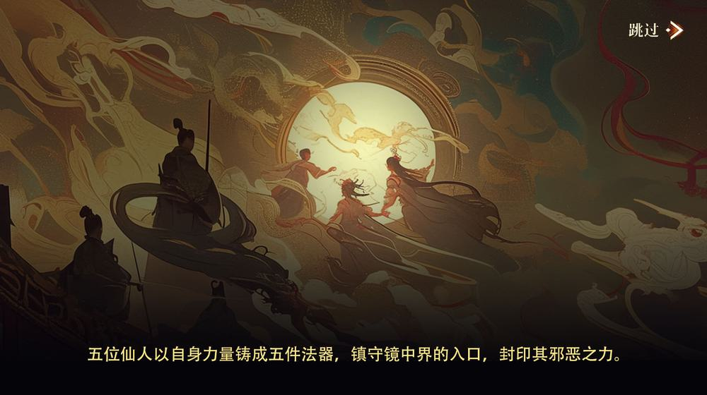

# 《九州行：长生秘镜》

## 世界背景
### 镜中界的传说  
天地初开时，山海之间诞生了镜中秘境。传说此地蕴藏奇珍异宝与强大力量。因争夺宝物，秘境陷入混乱，被仙人用五件“镇镜之器”封印。数百年后，封印松动，导致异象频发，各方势力蠢蠢欲动。

#### 第一层：天地初开，镜中界的诞生   
“混沌之初，天地未分，万物无形。一面镜子从虚无中浮现，它映照天地，分离光暗，化育万物。人称此镜为‘始境’，其内部孕育出一片奇幻之地，名为‘镜中界’。”
   
壁画描绘：
混沌之中，一面巨大的镜子悬浮于黑暗与光明交界处，镜面倒映出一片神秘的世界。
镜中界的图景描绘出漂浮的山川、倒映的星河、光影交织的奇花异草。
镜子周围逐渐显现出原始的神祇，他们手持光环或法器，象征天地初开的秩序。
#### 第二层：仙人封印“镜中界”的五件法器   
镜中界之灵有善亦有恶，善灵滋养万物，恶灵却妄图破界而出，危及人间。  
   
五位仙人以自身力量铸成五件法器，镇守镜中界的入口，封印其邪恶之力。  
   
壁画描绘：
五位仙人伫立在镜子周围，分别铸造出五件“镇镜之器”。  
- 玄铁心镜：仙人以火锤敲打陨铁，心镜释放出驱散迷雾的光芒。
- 苍木灯盏：另一位仙人以鬼木雕刻出灯盏，点燃时光之火，净化黑暗。
- 玲珑水匣：仙人以灵泉注入水匣，形成时间的源泉，周围流水倒流成瀑。
- 白羽仙符：一位羽化而飞的仙人将一片白羽化为符箓，轻灵风动，象征自由。
- 赤焰焚铃：最后一位仙人伫立于火山，铸造赤焰铜铃，烈焰焚烧邪灵幻象。   

五件法器漂浮于镜面之上，封印了镜中界的裂隙，光芒将黑暗力量驱逐。

#### 第三层：门派守护秘宝、人与魔教争斗的历史   
“千年之后，封印渐渐减弱，魔教觊觎镜中界的奇珍与力量，掀起血雨腥风。仙人传下的五件法器成为江湖门派争夺的目标。传闻某小门派获得了一件‘镇镜之器’，成为守护封印的最后一道屏障。”   
   
壁画描绘：
镜中界的裂隙逐渐显现，黑暗邪灵的影子从镜中蔓延到人间，天空染上红霞，江湖动荡。
一个小门派在残破的山门前，举着一件散发微光的法器，抵抗魔教的侵袭。
魔教中强大的邪灵化身为巨大黑影，挥舞利爪，扑向门派，周围火焰与废墟交织。
最终画面以门派掌门将法器藏于密室，面露坚定的神色，暗示了后续的故事。

### 秘宝传说  
守护镜中界封印的秘宝不仅能平息混乱，还能赐予长生之力，吸引魔教和江湖势力竞相争夺。

***
## 主角的起点
### 身份与背景  
主角是一个小门派的杂役弟子，资质平庸，却心地善良，勤奋努力。

### 青梅竹马  
掌门的女儿是主角的青梅竹马，活泼开朗，经常帮助主角，两人感情深厚。

### 灾难降临  
- 魔教突袭门派，强夺封印秘宝。  
- 青梅竹马为保护秘宝，被魔教头领“寒冰掌”击伤，中毒昏迷不醒。  
- 掌门拼死护法，临终告知主角镜中界和“镇镜之器”的秘密。  

### 冒险起点  
为救青梅竹马和阻止魔教破坏江湖平衡，主角踏上收集法器、解开封印之谜的冒险之旅。

***
## 旅途

### 目标：寻找“镇镜之器”  
传说中，五件“镇镜之器”分散于江湖与镜中界。它们象征五种自然之力，主角需通过试炼将它们重新集齐：  
1. **玄铁心镜**：吸收千年精气的古镜，可破开镜中迷雾。  
2. **苍木灯盏**：用百年鬼木雕成的灯盏，可点燃迷障之火。  
3. **玲珑水匣**：内藏灵泉的小匣，可解开倒流的时光。  
4. **白羽仙符**：仙鹤羽毛化成的符箓，可借风飞渡悬崖秘境。  
5. **赤焰焚铃**：烈焰铸成的铜铃，可震碎邪灵幻象。  

### 挑战：收集“镇镜之器”  
#### 玄铁心镜  
- **地点**：荒废的铁矿，内有熔岩流动和土灵怪。  
- **挑战**：破解熔岩机关，利用镜面反射引导光线开启矿脉通道，与“地甲巨灵”战斗。  

#### 苍木灯盏  
- **地点**：被迷雾笼罩的古森林。  
- **挑战**：镜面反射光线引导主角破除幻术迷阵，点燃灯盏驱散树妖的埋伏。  

#### 玲珑水匣  
- **地点**：镜中界的倒流瀑布区域。  
- **挑战**：修复被时间侵蚀的水匣，躲避“时波兽”的时间操控攻击。  

#### 白羽仙符  
- **地点**：镜中界悬浮的孤岛。  
- **挑战**：完成空中风灵试炼，驯服“风灵鸟”并操控镜像投影突破高空障碍。  

#### 赤焰焚铃  
- **地点**：炽热的火山秘境。  
- **挑战**：在毒雾与熔岩流中寻找铜铃，与“炎灵兽”战斗，用法器熔铸火山之力。  

### 镜中界与江湖的奇幻探索

#### 镜中界的玩法  
##### 奇幻物理法则  
- **镜像空间**：场景中可利用镜子投影敌人影像，破解空间中的谜题。  
- **光线反射**：特定区域通过光线反射揭示隐藏路径，或激活秘宝机关。  
- **镜像分身**：主角可短暂制造镜像分身，与敌人周旋或协助解谜。  

##### 特色秘境  
- **倒影湖泊**：主角需要通过操作水面反射解开谜题。  
- **倒置世界**：进入一个天地颠倒的区域，需适应上下颠倒的规则破解机关。  
- **碎镜领域**：玩家需在破碎的镜片间穿梭，通过拼接碎片修复通道。

#### 江湖的冒险  
##### 门派与势力冲突  
魔教与其他门派同样在寻找法器，主角需应对追杀与抢夺，甚至利用他们的争斗为自己创造机会。  

##### 现实与镜中界的联动  
- 破解镜中秘境的谜题会影响江湖世界的环境，例如打开水镜机关解救被洪水淹没的村庄。  
- 江湖中的势力争斗与秘境谜题交织，增加紧张感与探索动力。

## 最终决战与结局

### 高潮：拯救与抉择  
#### 决战准备  
主角集齐“镇镜之器”，在镜中界核心区域展开最终试炼。  
- **镜湖封印战**：主角在一片巨大的镜湖上破解多重封印，需利用所有法器的力量与能力。  
- **多阶段战斗**：与魔教头领及释放出的邪灵展开激烈对抗。  

#### 最终抉择  
- **牺牲与守护**：主角必须选择牺牲自己，维持镜中界的封印，或释放更强的力量迎战邪灵，承担未知后果。  
- **情感线的高潮**：青梅竹马的生死可能因主角的抉择而改变。

### 结局：江湖的余波  
#### 镜中界的未来  
封印维持，但主角与镜中界失去联系，花灵伙伴化为守护镜中的自然之力。  

#### 江湖的平衡  
江湖恢复平静，魔教势力暂退，但隐忧未消。主角成为传说中的“镜中界守护者”，选择隐居或继续行走江湖。  

#### 情感与启示  
主角回望江湖风云，感悟奇幻与现实、善与恶的交织，真正的侠义是守护平衡与生命的意义。
