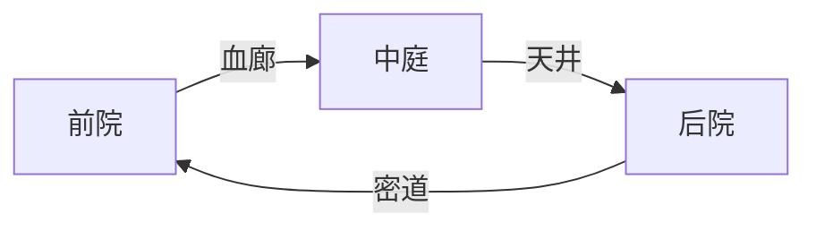

# 《冥府诡契：红丝缚魂》完整角色设计  
**最后更新：2025年5月12日**  

---

## 一、追猎者阵营（中式恐怖化身）  

### 1. 红煞·阴婚新娘（控场型）  
**背景故事**  
> 清末江南大户嫡女，因家族为镇压水患被活祭冥婚。怨气与嫁衣红绸融合成煞，裙摆血丝浸透尸油与朱砂，誓要将所有生者拖入未完成的拜堂仪式。  

**技能设计**  
- **「血丝缚魂」**  
  释放嫁衣红丝缠绕10米内目标，3秒未挣脱触发「冥婚定身」：  
  - 定身期间每秒流失5%生命值  
  - 成功献祭可恢复自身20%生命  
- **「囍堂巡游」**  
  召唤纸人抬轿巡游：  
  - 遮挡逃亡者视野并吸引场景纸人围攻  
  - 轿内灯笼照射区域红丝蔓延速度+50%  

---

### 2. 白煞·傩面傀儡师（追击型）  
**背景故事**  
> 傩戏班主因亵渎神灵被村民制成提线木偶，青面獠牙傩面附着枉死戏伶的怨魂，青铜锁链贯穿四肢关节悬空操控。  

**技能设计**  
- **「傩面摄魂」**  
  抛出傩面附身目标：  
  - 视野扭曲（画面边缘出现鬼手抓挠特效）  
  - 每5秒暴露位置2秒，持续15秒  
- **「百鬼游街」**  
  召唤12具纸人傀儡形成包围圈：  
  - 缩小活动范围至原区域50%  
  - 纸人触碰造成「阴气侵蚀」减速20%  

---

### 3. 血织娘·怨丝傀儡（控场型）  
**背景故事**  
> 绣坊织女被活葬镇压河妖，尸体与红绸裹尸布融合，十指延伸的丝线浸染河底淤泥与腐鱼腥气。  

**技能设计**  
- **「千丝缚魂」**  
  地面生成动态蔓延的红丝网：  
  - 每层「怨丝缠绕」降低5%移速（上限5层）  
  - 叠满触发3秒定身并召唤溺死鬼拖拽  
- **「血水漫溢」**  
  在丝网区域生成浑浊血水：  
  - 破译速度-30%  
  - 每秒有10%概率触发「浮尸抓手」禁锢1秒  

---

### 4. 傩尸匠·赶尸人（召唤型）  
**背景故事**  
> 湘西赶尸匠偷学《鲁班书》禁术遭反噬，背后竹篓装载腐烂僵尸，褪色符咒控制尸群撕咬生者。  

**技能设计**  
- **「控尸术」**  
  召唤三类僵尸：  
  | 类型   | 特性                  | 克制方式          |  
  |--------|-----------------------|-------------------|  
  | 饿死鬼 | 骨瘦如柴/移速+30%     | 桃木钉封印20秒    |  
  | 吊死鬼 | 长舌缠绕禁锢2秒       | 黑狗血泼洒驱散   |  
  | 水鬼   | 水域移速+50%          | 朱砂符咒镇退     |  
- **「尸爆术」**  
  未被封印的僵尸30秒后自爆：  
  - 造成半径5米范围伤害  
  - 残留「尸毒」区域（持续10秒，每秒损失3%生命）  

---

### 5. 画皮妖·戏妆魅影（伪装型）  
**背景故事**  
> 戏班名伶因妒忌被剥皮制成画皮妖，可窃取生者容貌混入人群，胭脂盒中藏有致幻迷香。  

**技能设计**  
- **「替形换骨」**  
  复制目标外观并同步动作：  
  - 真身移动无脚步声  
  - 无法与场景「镇魂铃」互动（最大破绽）  
- **「胭脂惑心」**  
  散播红色粉末：  
  - 受影响者视野中队友显示为追猎者  
  - 持续8秒，冷却90秒  

---

### 6. 符咒天师·玄冥（控场型）  
**背景故事**  
> 茅山道士堕入邪道，肉身与《太上玄门咒》禁篇融合，道袍内衬写满血书符箓。  

**技能设计**  
- **「九幽符阵」**  
  布设五行符阵：  
  | 阵型 | 效果                     | 破解方式          |  
  |------|--------------------------|-------------------|  
  | 金阵 | 破译速度-25%             | 黑狗血泼洒阵眼    |  
  | 木阵 | 生成藤蔓缠绕3秒          | 火烧藤蔓根部      |  
  | 水阵 | 每秒叠加「溺亡恐惧」状态 | 放置青铜烛台      |  
  | 火阵 | 焚烧纸人傀儡             | 紫薇星砂熄灭      |  
  | 土阵 | 生成护盾抵挡致命伤害     | 铜镜反射破除      |  
- **「天雷引」**  
  召唤雷击劈中携带「阴契符」目标：  
  - 造成真实伤害（无视护盾）  
  - 触发「魂魄离体」暴露位置10秒  

---

## 二、逃亡者阵营（民俗职业者）

### 1. 风水师程墨（辅助型）  
**背景故事**  
> 精通《鲁班书》残卷的风水先生，因强开天眼导致左目失明，罗盘指针浸染黑狗血。  

**技能设计**  
- **「寻龙点穴」**  
  每60秒标记追猎者方位：  
  - 指针旋转速度随距离变化（越近转速越快）  
  - 持续5秒，冷却80秒  
- **「镇煞符」**  
  短暂封印场景纸人：  
  - 需消耗3张「黄纸」道具  
  - 封印半径8米，持续15秒  

---

### 2. 扎纸匠阿莲（破译型）  
**背景故事**  
> 家族传承扎纸秘术的少女，右臂留有被纸人反噬的灼伤疤痕，竹篾编织速度堪比机械。  

**技能设计**  
- **「纸马渡阴」**  
  制作替身纸马：  
  - 抵挡一次致命攻击后消散  
  - 需收集「竹篾x3 + 黄纸x1」重新制作  
- **「纸人伪装」**  
  伪装成场景纸人：  
  - 持续10秒，冷却120秒  
  - 移动速度降至正常30%  

---

### 3. 赊刀人·凶兆预言者（战略型）  
**背景故事**  
> 行走阴阳的赊刀客，背负的凶刃刻满《推背图》谶语，能通过刀刃震颤预知死亡方位。  

**技能设计**  
- **「凶兆卜算」**  
  预言追猎者下次技能方位：  
  - 成功预判重置冷却时间  
  - 失败则延长冷却30秒  
- **「断魂斩」**  
  挥刀斩断控制效果：  
  - 可切断红丝/傩面/符咒束缚  
  - 使用后进入60秒冷却  

---

### 4. 问米婆·通阴使者（治疗型）  
**背景故事**  
> 以阴米沟通饿鬼道的老妪，香炉中供奉着49个饿死孩童的魂魄，嘴角永远残留米粒。  

**技能设计**  
- **「阴米续命」**  
  撒出浸染香灰的阴米：  
  - 恢复20%生命值并附加10%减伤  
  - 同时提升被傩神锁定概率30%  
- **「阴兵借道」**  
  禁忌触发条件：  
  - 连续使用三次后召唤无差别攻击的阴兵  
  - 阴兵存在30秒，期间场景纸人活性+50%  

---

### 5. 哭丧人·悲鸣镇魂师（干扰型）  
**背景故事**  
> 丧礼执棒人，自幼与尸体为伴，丧棒顶端镶嵌往生者牙齿，敲击声能引动地脉阴气。  

**技能设计**  
- **「悲鸣镇魂」**  
  敲击丧棒发出刺耳哭嚎：  
  - 10米内追猎者眩晕2秒  
  - 同时吸引场景纸人围攻自身  
- **「纸钱引路」**  
  抛洒特制纸钱：  
  - 形成半径5米安全区，持续8秒  
  - 区域内队友移速+15%  

---

### 6. 巫蛊师·阿蛮（干扰型）  
**背景故事**  
> 苗疆蛊女，右臂寄生「噬心蛊王」，以自身血肉饲蛊，瞳孔中可见蛊虫游动痕迹。  

**技能设计**  
- **「蛊毒蚀心」**  
  释放蛊虫附着目标：  
  - 技能冷却延长20%  
  - 持续10秒，每秒损失1%生命值  
- **「血蛊爆」**  
  引爆所有存活蛊虫：  
  - 造成半径8米范围伤害  
  - 自身损失15%生命值  

---

### 7. 戏法师·青鸢（陷阱型）  
**背景故事**  
> 戏班出身的机关天才，袖中暗藏火药磷粉，面具下隐藏被烧毁的半张面孔。  

**技能设计**  
- **「皮影戏法」**  
  布置两类机关：  
  | 类型       | 效果                     |  
  |------------|--------------------------|  
  | 爆炸纸蝶   | 造成眩晕与燃烧伤害       |  
  | 烟雾傀儡   | 生成持续10秒的视野遮蔽区 |  
- **「双生傀儡阵」**  
  与其他戏法师协作：  
  - 封锁区域15秒  
  - 范围内追猎者移速-40%  

---

### 8. 阵法师·符箓控局（辅助/控场型）  
**背景故事**  
> 茅山符咒一脉叛徒，左眼被《太上玄门咒》反噬成阴阳眼，能看见三界六道众生。  

**技能设计**  
- **「五行符阵」**  
  需队友协作激活阵法：  
  | 阵型 | 激活条件           | 效果                     |  
  |------|-----------------------|--------------------------|  
  | 金阵 | 3人同时站立阵眼   | 破译速度+30%             |  
  | 木阵 | 放置桃木剑         | 生成治疗光环（每秒2%）  |  
  | 水阵 | 泼洒黑狗血         | 解除控制效果             |  
  | 火阵 | 点燃符咒           | 焚烧追猎者护体怨气       |  
  | 土阵 | 堆叠石块           | 生成抵挡一次攻击的护盾   |  

---

### 9. 机关师·灵傀匠人（陷阱/召唤型）  
**背景故事**  
> 湘西赶尸匠后人，右臂替换阴木机关义肢，指甲缝永远残留竹篾碎屑与磷粉灼痕。  

**技能设计**  
- **「灵傀召唤」**  
  制造三类机关傀儡：  
  | 类型       | 消耗材料         | 功能                     |  
  |------------|------------------|--------------------------|  
  | 纸人探路傀 | 黄纸x2          | 侦查10米内追猎者位置     |  
  | 石傀镇煞   | 石块x3 + 朱砂x1 | 吸引仇恨并反弹20%伤害    |  
  | 铜傀自爆   | 青铜x1 + 火药x2 | 造成范围眩晕与燃烧伤害   |  
- **「冥火灯笼」**  
  悬挂符咒灯笼：  
  - 照亮半径15米区域  
  - 追猎者进入触发「磷火灼烧」  

---
### 10. 灵探·通灵少女（探索/治疗型）
**背景故事**
> 民俗学系高材生，因参与古宅探险意外获得通灵能力。随身携带的灵异相机能捕捉常人不可见的线索，急救包中混有特殊草药可治疗阴气侵蚀。

**技能设计**
- **「灵视显影」**
  使用相机拍摄场景：
  - 显示30秒内发生的灵异痕迹
  - 可标记追猎者最近出现位置
- **「草药急救」**
  使用特殊配方治疗：
  - 立即恢复15%生命值
  - 清除1层负面状态（限阴气类）
- **「通灵感应」**
  被动技能：
  - 10米内有灵体时眼镜发光预警
  - 破解机关速度+20%  
## 三、场景设计

 
### 1. **红绸囍堂（主战场）** 
- **核心机制**：
  - 空中悬浮72盏魂瓮灯笼，击碎可释放怨灵干扰追猎者
    - 灯笼分为3种类型：
      | 类型       | 效果                     | 破解方式          |
      |------------|--------------------------|-------------------|
      | 血灯笼     | 释放血雾降低视野范围     | 风水师罗盘定位    |
      | 魂灯笼     | 召唤1个怨灵追击         | 扎纸匠纸马吸引   |
      | 煞灯笼     | 生成红丝缠绕减速区域     | 赊刀人斩断       |
  - 地面骸骨棋盘随时间重组为「卍字佛印」，触发地底苍白鬼手抓取
    - 每60秒重组1次，形成不同阵法效果
    - 完整卍字阵触发全屏鬼手，需3人同时踩阵眼破解
- **视觉特征**：房梁悬挂百具往生阁黑袍尸体，红绸随战斗进展逐渐被血浸透
  - 战斗时长影响环境变化：
    | 阶段 | 环境变化                 |
    |------|--------------------------|
    | 0-5分 | 红绸轻微飘动，灯笼亮度正常 |
    | 5-10分 | 血丝蔓延，部分灯笼变红    |
    | 10分+ | 全部灯笼变红，房梁尸体开始晃动 |

### 2. **渡魂码头（水域地图）** 
- **动态环境**：
  - 水域中漂浮刻有往生咒的指甲，触碰触发「溺死鬼拖拽」禁锢3秒
    - 指甲分布规律：随潮汐变化移动位置
    - 满月时数量加倍，形成死亡陷阱区
  - 紫薇星砂腐蚀形成的蜂窝状孔洞，需用扎纸匠的纸船道具渡河
    - 孔洞会随时间扩大/缩小，形成动态路径
    - 错误跳跃会触发「水鬼突袭」
- **特殊机制**：
  - 潮汐系统：
    | 潮汐阶段 | 水位变化 | 效果                     |
    |----------|----------|--------------------------|
    | 涨潮     | +1.5米   | 部分陆地变为水域         |
    | 退潮     | -2米     | 暴露隐藏的沉船残骸      |
  - 渡船竞速：
    - 同时激活3个码头灯笼可召唤大渡船
    - 全队登船后10秒内离岸可避开追猎者

### 3. **傩神庙（Boss战场）** 
- **终极仪式**：
  - 逃亡者需在傩神像前完成「血契解除」，期间追猎者召唤纸人抬轿巡游封锁出口
    - 仪式分3阶段，需不同职业协作：
      1. 风水师定位「生门」方位
      2. 问米婆献祭阴米安抚傩神
      3. 阵法师绘制破煞符阵
  - 地面浮现《推背图》谶语符文，错误解读将引发「傩面爆裂」全屏AOE
    - 符文解密规则：
      | 符文类型 | 正确解读               | 错误惩罚               |
      |----------|------------------------|------------------------|
      | 天干地支 | 需按生肖顺序点击       | 召唤12傩面鬼追击       |
      | 五行相克 | 需逆向破解属性关系     | 触发对应五行伤害       |
      | 九宫八卦 | 需踩踏对应方位阵眼     | 生成持续10秒的伤害区域 |
- **Boss机制**：
  - 每破解1个符文，追猎者进入10秒虚弱状态
  - 全部破解后，可对傩神像造成致命伤害

## 四、核心玩法系统设计

## 1. 阴契系统运作机制
### 追猎者维度
- **红丝收集**：每击败1名逃亡者获得1片契约碎片（3片可合成完整契约）
- **魂力觉醒**：
  - 初级觉醒（3碎片）：解锁特殊追击技能（如"鬼步"瞬移）
  - 终极觉醒（5碎片）：变身Boss形态，获得范围控制技能

## 2. 动态场景系统
### 核心场景拓扑

### 逃亡者维度
- **血契反制**：
  - 收集散落场景中的"破契符"（限3张）
  - 可对追猎者使用，使其技能失效5秒
  - 使用后触发30秒冷却

## 2. 动态场景系统
### 昼夜循环机制
| 时段 | 追猎者增益 | 逃亡者优势 |
|------|------------|------------|
| 子时（23-1） | 视野+30% | 移动静音 |
| 午时（11-13） | 技能冷却-20% | 治疗效率+50% |

### 场景机关互动
1. **阴婚花轿**（随机事件）
   - 触发条件：3名以上逃亡者聚集
   - 效果：召唤NPC迎亲队伍阻挡追猎者
   - 破解：追猎者需完成"斩轿"QTE

## 3. 胜负判定系统
### 基础胜利条件
- 追猎者：在时限内阻止80%逃亡者逃脱
- 逃亡者：50%成员达成以下任一条件：
  - 修复全部5处"断龙桩"
  - 存活至鸡鸣时分（游戏时间20分钟）

### 特殊结局
- **同归于尽**：当追猎者与最后1名逃亡者同时死亡时
- **魂飞魄散**：逃亡者使用禁术反杀追猎者（需收集全部9张符咒）

## 4. 核心玩法循环细节

### 4.1 追猎者玩法深度
1. **猎杀节奏控制**：
   - 基础移动速度：3.5m/s
   - 技能冷却阶梯：
     | 碎片数量 | 冷却缩减 | 效果持续时间 |
     |----------|----------|--------------|
     | 0        | 0%       | 5s           |
     | 3        | 15%      | 7s           |
     | 5        | 30%      | 10s          |

2. **环境互动特权**：
   - 可操纵场景机关（限3种）：
     1. 触发尸爆（范围伤害）
     2. 召唤伥鬼（移动障碍）
     3. 阴风领域（减速区域）

### 4.2 逃亡者生存策略
1. **团队协作机制**：
   - 双人合作动作（需2秒引导）：
     - 搭人梯翻越高墙
     - 联合破解机关
     - 血脉相连（分担伤害）

2. **道具合成系统**：
   | 材料组合          | 合成结果       | 使用效果               |
   |-------------------|----------------|------------------------|
   | 朱砂+黄纸         | 镇魂符         | 定身追猎者3秒          |
   | 黑狗血+铜钱       | 破煞钉         | 破坏追猎者1个技能      |
   | 骨灰+红绳         | 替身人偶       | 制造1次假死亡          |

### 4.3 动态难度系统
1. **天平算法**：
   - 实时监测双方胜率差
   - 自动调节：
     - 追猎者优势时：增加逃亡者道具刷新
     - 逃亡者优势时：提前黑夜时段

2. **新手保护**：
   - 前3局游戏：
     - 追猎者技能提示标记
     - 逃亡者关键道具高亮
     - 机关互动引导教程